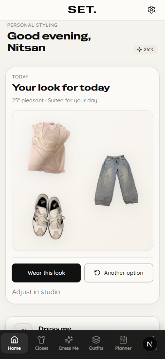
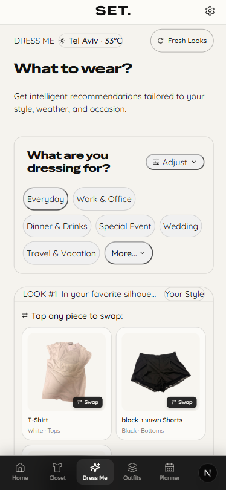
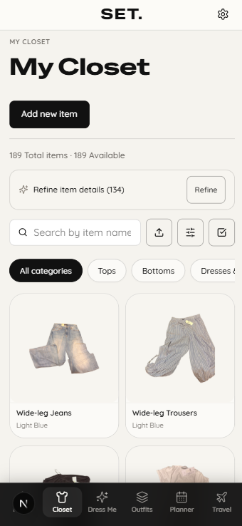
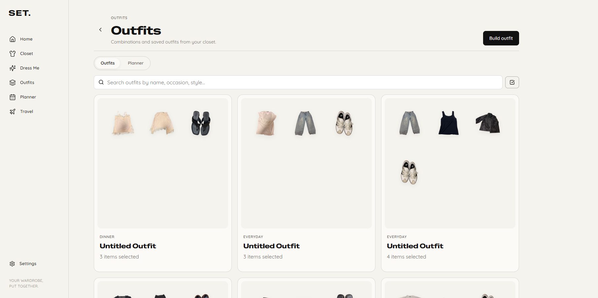
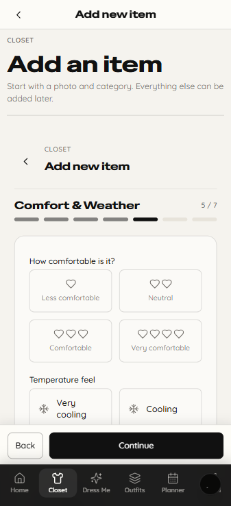

# SET | Smart Wardrobe & Outfit Recommendation Platform

SET is a mobile-first wardrobe product that helps users organize what they own, build valid outfits, plan for trips, and receive personalized recommendations based on **occasion, style, weather, comfort, and learned preferences**.

I am building SET around a simple product problem: having a full closet does not necessarily make getting dressed easier. The product turns a personal wardrobe into structured, useful data and uses that structure to reduce decision friction.

> **Portfolio showcase:** this repository is a curated product and engineering snapshot based on a private production codebase. SET is actively under development. Production credentials, user data, administrative scripts, deployment configuration, and internal tooling are intentionally excluded.

## Product preview

<p align="center">
  
  &nbsp;&nbsp;
  
  &nbsp;&nbsp;
  
</p>

<p align="center"><sub>Personalized daily look · Dress Me recommendations · Digital closet</sub></p>

### Responsive product experience



SET is designed mobile-first because the main use case happens close to the wardrobe and during everyday decision-making. The desktop experience supports broader reviewing, organizing, planning, and travel workflows.

### Rich wardrobe metadata

<p align="center">
  
</p>

The item flow captures only the information that can become useful later, including category, appearance, fit, comfort, temperature behavior, styling context, and occasion suitability.

For a feature-by-feature walkthrough, see [`docs/PRODUCT_WALKTHROUGH.md`](docs/PRODUCT_WALKTHROUGH.md).

## Product problem

SET is designed around several recurring user problems:

- users own many items but repeatedly wear a small subset;
- deciding what works together creates unnecessary daily friction;
- weather often changes whether an outfit is actually practical;
- outfit apps can generate combinations that look technically possible but are structurally wrong;
- saved looks and past behavior contain useful preference signals that should improve future recommendations;
- packing for travel creates a smaller, temporary wardrobe with different constraints.

The product goal is not only to catalog clothing. It is to help users make better wardrobe decisions with less effort.

## Core product journey

```text
Add wardrobe items
      ↓
Enrich useful metadata
      ↓
Build / save outfits
      ↓
Ask SET what to wear
      ↓
Adjust to occasion + weather
      ↓
Learn from saved and worn looks
```

Travel mode applies the same system to a trip-scoped wardrobe.

## My role

I lead SET's product direction, UX, recommendation behavior, and end-to-end implementation.

My work includes:

- defining the product problem, feature priorities, and user journeys;
- designing the mobile-first UX, navigation, forms, filters, and recommendation flows;
- deciding which wardrobe attributes are useful enough to collect from users;
- translating styling expectations into explicit product rules and edge cases;
- defining recommendation behavior for occasion, weather, comfort, personalization, and diversity;
- designing travel mode and trip-scoped wardrobe behavior;
- building the full-stack product with Next.js, React, TypeScript, Supabase, and PostgreSQL;
- designing data flows, authentication behavior, storage, and product state;
- testing, debugging, reviewing recommendation quality, and iterating on UX and system behavior;
- supporting Hebrew / English and RTL product behavior.

The technical implementation is an important part of the project, but my main focus is the product itself: **what information users should provide, how the system should respond, which edge cases matter, and how the experience can reduce real decision friction**.

## Key product and UX decisions

### Mobile-first by use case

SET is not mobile-first only as a visual choice. The core interaction happens while users are choosing clothes, adding items, getting dressed, or packing. The navigation and flows are designed around that context.

### Progressive disclosure for wardrobe metadata

The system can use rich item metadata, but asking for everything at once would create a poor onboarding experience. Item creation is therefore split into guided steps, with lower-friction required information and progressively richer attributes.

### Recommendations should be explainable

Occasion, weather, comfort, and user preferences are visible product concepts rather than hidden black-box inputs. The system is designed so recommendation behavior can be inspected, tuned, and improved.

### Correctness before creativity

A recommendation is not useful if the outfit is structurally invalid. Product rules such as dress exclusivity, valid separates, footwear requirements, and plausible layering are enforced before ranking.

### Personalization should grow with evidence

SET does not treat a small number of user actions as absolute preference. Personalization becomes more influential as the system gathers stronger evidence from saved, built, and worn looks.

### Travel is a different wardrobe context

A packed suitcase creates a temporary subset of the user's closet. Travel mode reuses the same wardrobe and recommendation model while limiting the eligible inventory to the trip context.

## Core product areas

- Digital closet
- Guided Add Item flow
- Outfit builder
- Saved outfits
- Personalized Dress Me recommendations
- Occasion-aware recommendation behavior
- Weather and optional-layer logic
- Comfort and temperature preferences
- Recommendation swaps and iteration
- Outfit history and wardrobe rotation
- Planner
- Travel / suitcase mode
- English / Hebrew interface
- RTL support
- Responsive PWA behavior

## Recommendation system

The recommendation system is a product system, not just a scoring function. It combines structural rules, context, personalization, and diversity.

```text
User context
      ↓
Candidate generation
      ↓
Structural validation
      ↓
Styling coherence
      ↓
Occasion + weather + comfort
      ↓
Personal preference signals
      ↓
Quality threshold
      ↓
Diversity-aware ranking
```

### Structural outfit rules

Examples include:

- a dress or one-piece acts as a complete base and cannot be combined with pants or a primary top;
- separates require a valid top and bottom core;
- layering must represent a physically plausible combination;
- complete recommendations require footwear;
- bag, bottom, shoes, and outerwear slots respect canonical limits.

### Weather-aware behavior

The thermal model evaluates more than current temperature. It can account for garment type, material, layers, temperature drops, wind, rain, indoor cooling, and personal sensitivity.

The product can distinguish between:

- **layer required**
- **layer recommended**
- **layer not needed**

### Personalization

Preference signals can include silhouette, color palette, category combinations, footwear pairings, formality, materials, item affinity, and repeated item pairs.

Personalization is confidence-aware so weak evidence does not overpower general outfit quality.

See [`docs/RECOMMENDATION_ENGINE.md`](docs/RECOMMENDATION_ENGINE.md).

## Technical architecture

SET follows a layered structure:

```text
Presentation
    ↓
Feature / Application
    ↓
Domain
    ↓
Infrastructure adapters
```

The Domain layer keeps recommendation, outfit validation, personalization, and weather logic independent from React, Next.js, Supabase, and provider-specific APIs.

See [`docs/ARCHITECTURE.md`](docs/ARCHITECTURE.md).

## Tech stack

- **Next.js / React / TypeScript**
- **Supabase / PostgreSQL / Row Level Security**
- **TanStack Query**
- **Zod + React Hook Form**
- **Vitest + React Testing Library**
- **Playwright**
- **Vercel**
- **PWA**
- **Hebrew / English i18n and RTL support**

## Selected code samples

The `code-samples/` directory contains selected modules from the private codebase:

- [`generateRecommendations.ts`](code-samples/recommendation/generateRecommendations.ts) - recommendation orchestration, scoring, quality gating, and diversity.
- [`validateOutfitInvariants.ts`](code-samples/outfits/validateOutfitInvariants.ts) - canonical structural outfit rules.
- [`thermal.ts`](code-samples/weather/thermal.ts) - weather suitability and optional-layer reasoning.

The showcase is intentionally not a deployable production clone.

## Product questions I can discuss in an interview

- Which item attributes are worth asking users to enter, and which create unnecessary friction?
- How should occasion categories overlap without becoming redundant?
- When should an elegant item also be eligible for everyday recommendations?
- How do you prevent invalid outfits before ranking them?
- How should missing wardrobe metadata affect confidence rather than block recommendations?
- How do saved outfits become personalization evidence?
- When should weather require a layer versus only recommend one?
- How do you keep recommendations diverse without sacrificing relevance?
- How should travel mode reuse the same product logic with a different inventory scope?

See [`docs/ENGINEERING_CASE_STUDY.md`](docs/ENGINEERING_CASE_STUDY.md) for deeper implementation decisions.

## Product status

SET is in **active development**. Product behavior, recommendation quality, UX, testing, data modeling, and security continue to evolve as the system becomes more complete.

The private production repository remains the canonical implementation. This public repository is a curated portfolio snapshot.

## Security and scope

This showcase intentionally excludes:

- environment files and production credentials;
- Supabase service-role credentials;
- destructive or administrative scripts;
- raw production user-data exports or private storage assets;
- internal AI/tooling directories;
- deployment-only configuration.

---

**Project:** SET  
**Status:** Active development  
**Focus:** Product management · UI/UX · recommendation behavior · full-stack execution
